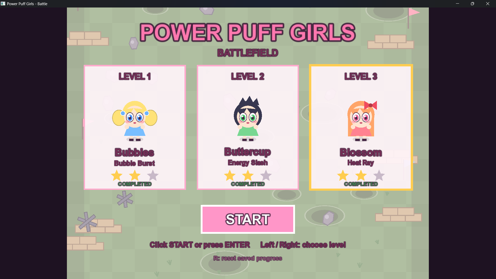
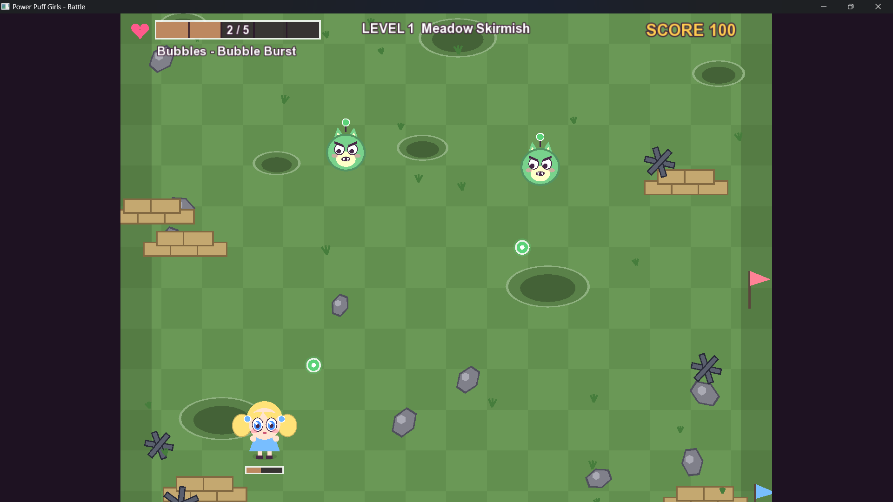
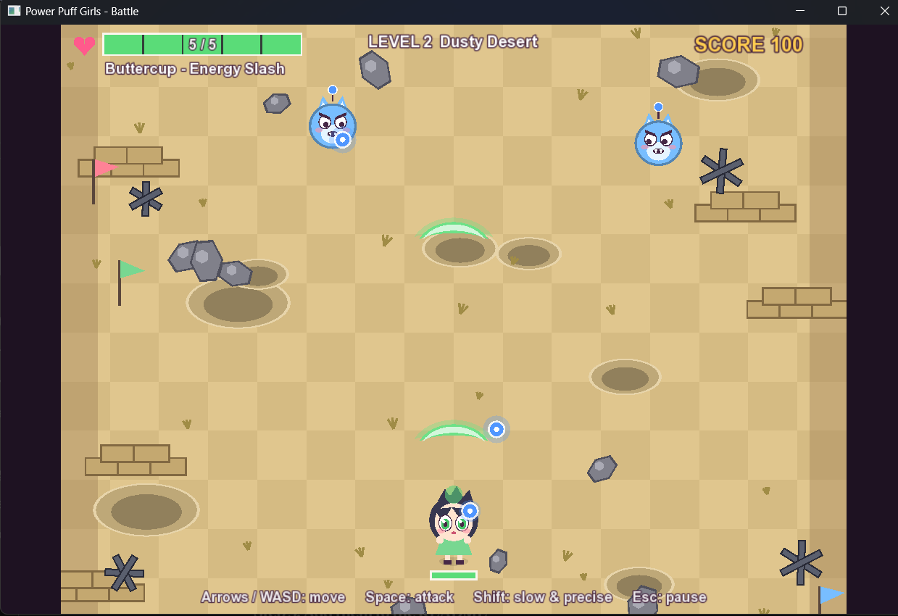
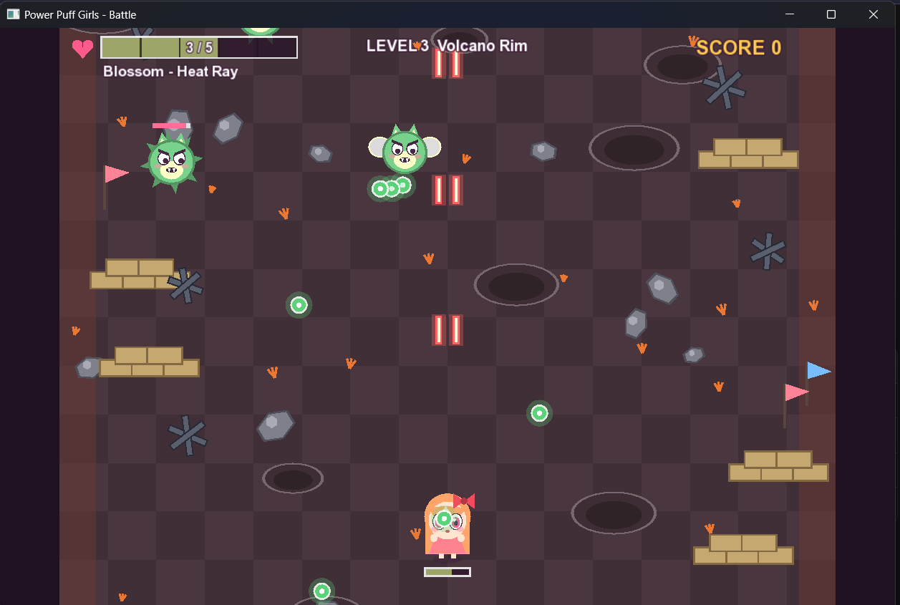
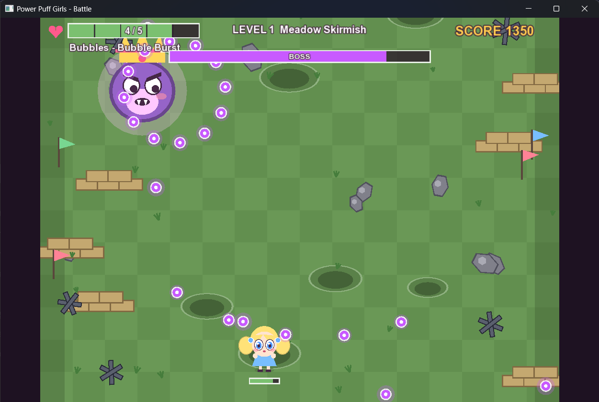
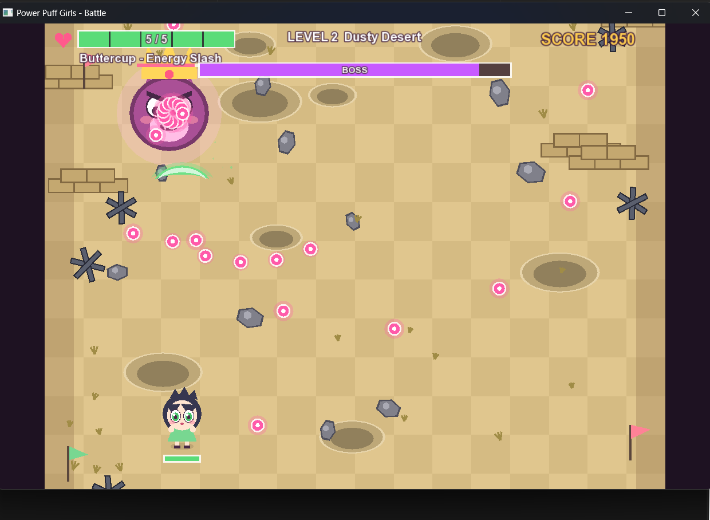
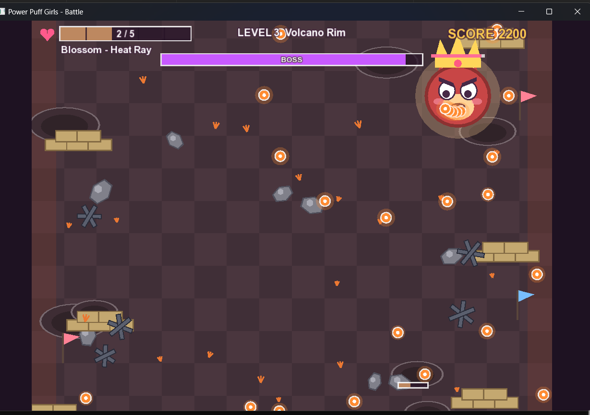
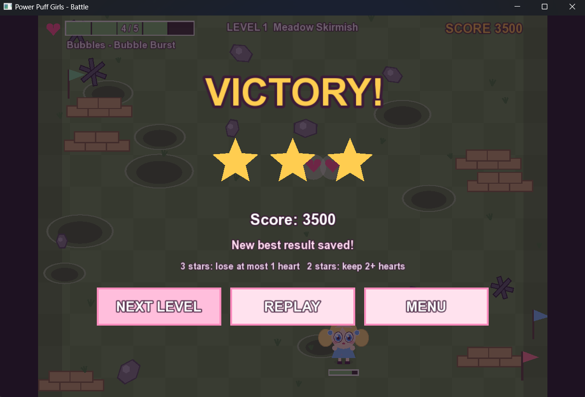
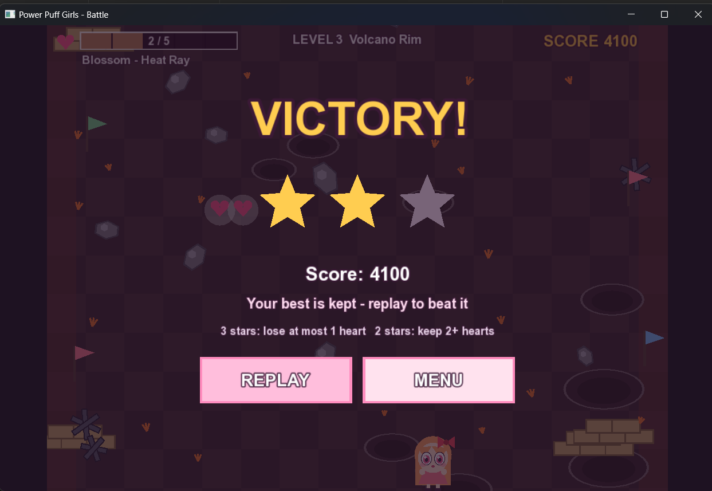

# Powerpuff Girls - Battle Game

A 2D shoot-'em-up written in **C++17** with **Qt 6** (window and input) and **SFML 2.6** (graphics and sound).
Three levels, three heroines, bosses, health pickups, star ratings and saved progress.
Everything is drawn in code and all sound effects are synthesised in code, so the game needs **no image or sound files**.

> **Disclaimer:** unofficial fan project made for learning. Not affiliated with, endorsed by, or connected to
> Warner Bros. or Cartoon Network. *The Powerpuff Girls* and its characters belong to their respective owners.

## Features

- **Menu** with a START button (click or press Enter) and three level cards showing 0-3 stars or a padlock
- **3 levels**, each with its own heroine and super power:

| Level | Heroine | Power | Battlefield |
|-------|---------|-------|-------------|
| 1 | Bubbles | Bubble Burst (three-bubble fan) | Meadow |
| 2 | Buttercup | Energy Slash (piercing crescent) | Desert |
| 3 | Blossom | Heat Ray (rapid twin beams) | Volcano rim |

- Waves of enemies (drifters, strafers, divers) followed by a **boss** with two phases
- **Health bar** for the player and every damaged enemy, plus a boss bar
- **Heart pickups** dropped by enemies and slow health regeneration when you are not hit
- **Stars:** 1 for winning, 2 for finishing with 2+ hearts, 3 for finishing with 4+ hearts
- A level unlocks when the previous one is completed; completed levels can be replayed to improve stars
- **Saved progress** in `ppg_progress.txt`
- Generated sound effects: attacks, hits, enemy defeated, player hurt, pickup, boss alert, victory, defeat

## Controls

| Key | Action |
|-----|--------|
| Arrow keys / WASD | Move |
| Space (hold) | Attack |
| Shift | Slow, precise movement |
| Esc / P | Pause |
| Enter | Start / confirm |
| Left / Right | Choose level in the menu |
| R (press twice) | Reset saved progress (menu) |

## OOP concepts used

- **Abstraction:** `Character`, `Enemy` and `SuperPower` are abstract classes with pure virtual functions
- **Inheritance:** `Character` -> `Player`, `Enemy`; `Enemy` -> `DrifterEnemy`, `StrafeEnemy`, `DiveEnemy`, `BossEnemy`
- **Polymorphism:** enemies are stored as `std::unique_ptr<Enemy>` and each subclass runs its own `move()` and `fire()`
- **Encapsulation:** protected/private state with small public getters (`hp()`, `position()`, `takeDamage()`)
- **Composition:** a `Player` owns its `SuperPower`
- **Strategy pattern:** `SuperPower` with `BubblePower`, `SlashPower`, `HeatRayPower`
- **Template Method pattern:** `Enemy::update()` and `Enemy::draw()` are `final` and call overridable hooks
- **Factory:** `makePower()` and `GameManager::spawn()`
- **Modern C++:** smart pointers (RAII), `enum class`, namespaces, lambdas, `const` correctness, `override` / `final`

## Project structure

| File | Purpose |
|------|---------|
| `main.cpp` | Creates the Qt application and the main window |
| `GameWindow.h/.cpp` | Qt window that hosts the SFML render surface, forwards keyboard and mouse input |
| `GameManager.h/.cpp` | Menu, levels, waves, collisions, HUD, sound synthesis, saving |
| `Character.h/.cpp` | Player, enemies, projectiles, super powers |
| `CMakeLists.txt` | Build configuration |

## Build

Requirements: **Qt 6** (MinGW kit), **SFML 2.6.x** (same compiler as your Qt kit, for example GCC 13.1.0 MinGW 64-bit), **CMake 3.16+**.

1. Open `CMakeLists.txt` in Qt Creator and choose your Qt 6 MinGW kit.
2. In **Projects > Build Settings > Initial Configuration**, add a directory entry `SFML_DIR` pointing to the folder that contains `SFMLConfig.cmake` (for example `.../SFML-2.6.2/lib/cmake/SFML`).
3. Build and run. On Windows the SFML DLLs are copied next to the executable automatically.

Menu text uses a system font (Arial on Windows). If no font is found, put a `font.ttf` next to the executable.

## Screenshots

### Menu

### Gameplay
  

### Boss fights
  

### Victory
 

## Tech

C++17, Qt 6 Widgets, SFML 2.6 (graphics, window, system, audio), CMake
